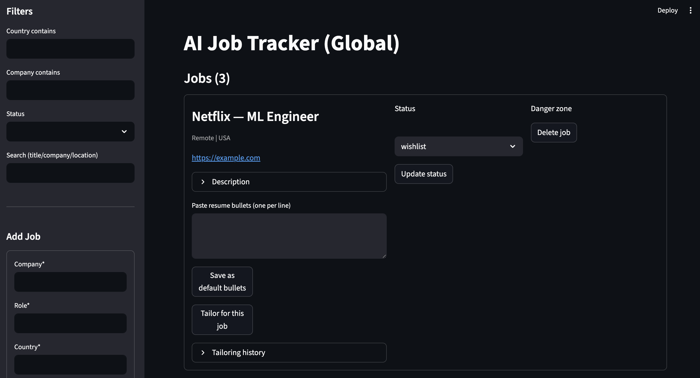
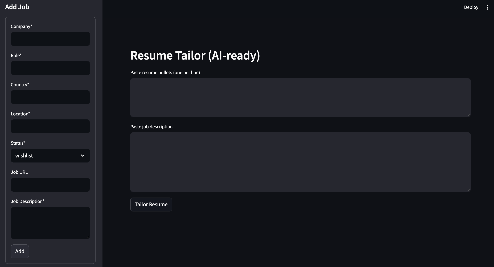
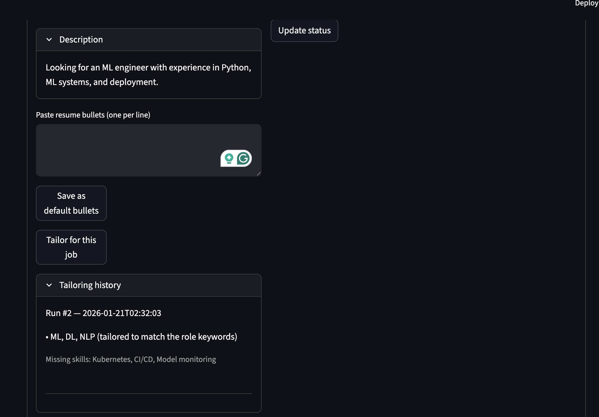

# AI Job Tracker + Resume Tailor (Global)

A lightweight job application tracker with per-job resume tailoring and saved tailoring history.

## Features
- Add, search, filter jobs (country, company, status)
- Update status (wishlist → applied → interview → offer → rejected)
- Tailor resume bullets for a specific job (AI-ready)
- Save and view tailoring history per job
- Export tailored bullets (.txt)
- FastAPI backend + Streamlit UI + SQLite

## Tech Stack
- FastAPI, SQLAlchemy, SQLite
- Streamlit UI
- Pytest (coming next)
- Optional: OpenAI (plug-in via env vars)

## Run locally
```bash
python3 -m venv .venv
source .venv/bin/activate
pip install -r requirements.txt

uvicorn app.main:app --reload --port 8001
streamlit run ui.py

## Screenshots

### Job Tracking 


### Resume Tailoring 


### Tailoring History

